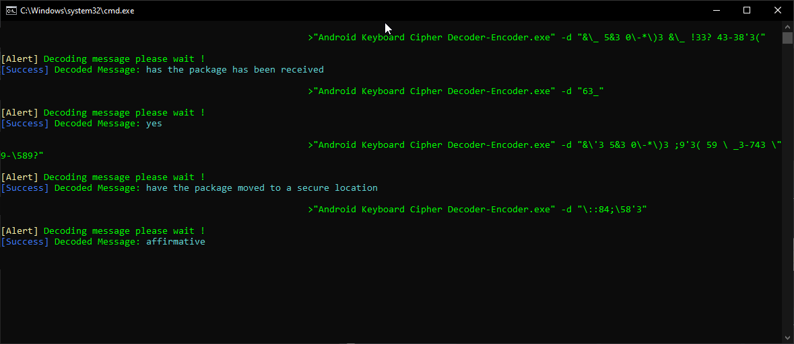

# Answers
Incase you are stuck here are the answers




# Implementation in C#

```cs
using System;
using System.Reflection;
using System.Collections.Generic;


namespace AKC
{
    class Program
    {
        private static ConsoleColor OriginalConsoleColor;
        public static Dictionary<char, string> CipherDictionary = new Dictionary<char, string>
        {
            {'1',"q"},
            {'2',"w"},
            {'3',"e"},
            {'4',"r"},
            {'5',"t"},
            {'6',"y"},
            {'7',"u"},
            {'8',"i"},
            {'9',"o"},
            {'0',"p"},
            {'\\',"a"},
            {'_',"s"},
            {'(',"d"},
            {':',"f"},
            {')',"g"},
            {'&',"h"},
            {'#',"j"},
            {'*',"k"},
            {'"',"l"},
            {'@',"z"},
            {'/',"x"},
            {'-',"c"},
            {Convert.ToChar("'"),"v"},
            {'!',"b"},
            {'?',"n"},
            {';',"m"}
        };

        public static Dictionary<char, string> EncryptDictionary = new Dictionary<char, string>
        {
            {'q',"1"},
            {'w',"2"},
            {'e',"3"},
            {'r',"4"},
            {'t',"5"},
            {'y',"6"},
            {'u',"7"},
            {'i',"8"},
            {'o',"9"},
            {'p',"0"},
            {'a',"\\"},
            {'s',"_"},
            {'d',"("},
            {'f',":"},
            {'g',")"},
            {'h',"&"},
            {'j',"#"},
            {'k',"*"},
            {'l',Convert.ToString('"')},
            {'z',"@"},
            {'x',"/"},
            {'c',"-"},
            {'v',"'"},
            {'b',"!"},
            {'n',"?"},
            {'m',";"}
        };

        private static string DecodedText;
        private static string EncodedText;
        private static string DecodedCharacter;
        private static string EncodedCharacter;


        private static void Main(string[] args)
        {
            OriginalConsoleColor = Console.ForegroundColor;
            if (args == null || args.Length == 0)
            {
                Console.ForegroundColor = ConsoleColor.Red;
                Console.Write("\n[Error] ");
                Console.ForegroundColor = OriginalConsoleColor;
                Console.Write("No valid arguments was specified \n");
                Console.WriteLine("Refer to the following for assistance\n");
                Console.WriteLine("Android Keyboad Ciper Decode/Encoder By Naix v" + Assembly.GetExecutingAssembly().GetName().Version.ToString() + " Console interface\n");
                Console.WriteLine("Command line options");
                Console.WriteLine("====================");
                Console.WriteLine("");
                Console.WriteLine("Usage: Android Keyboard Cipher Decoder - Encoder [arguments]");
                Console.WriteLine("-h | --help Displays this help menu");
                Console.WriteLine("-d | --decode <Encrypted Text> Decodes text encrypted in the Android Keyboard Cypher");
                Console.WriteLine("-e | --encode <Text to Encrypt> Encrypt Plain text (Only Alphabet only) using the Android Keyboard Cypher \n");
                Environment.Exit(0);
            }
            else
            {
                if (args[0].ToLower() == "-d" || args[0].ToLower() == "--decode")
                {
                    if ((args.Length == 1) == false)
                    {
                        Decode(args[1]);
                        Console.ForegroundColor = ConsoleColor.Yellow;
                        Console.Write("\n[Alert] ");
                        Console.ForegroundColor = OriginalConsoleColor;
                        Console.Write("Decoding message please wait !\n");
                        Console.ForegroundColor = ConsoleColor.Blue;
                        Console.Write("[Success] ");
                        Console.ForegroundColor = OriginalConsoleColor;
                        Console.Write("Decoded Message: ");
                        Console.ForegroundColor = ConsoleColor.Cyan;
                        Console.Write(DecodedText + "\n");
                        Console.ForegroundColor = OriginalConsoleColor;
                        Environment.Exit(0);
                    }
                    else
                    {
                        Console.ForegroundColor = ConsoleColor.Red;
                        Console.Write("\n[Error] ");
                        Console.ForegroundColor = OriginalConsoleColor;
                        Console.Write("No valid string was passed\n");
                        Console.ForegroundColor = ConsoleColor.Yellow;
                        Console.Write("[Alert] ");
                        Console.ForegroundColor = OriginalConsoleColor;
                        Console.Write("Android Keyboard Cipher Decoder - Encoder -d | --decode <Encrypted Text> Decodes text encrypted in the Android Keyboard Cypher \n");
                        Environment.Exit(0);
                    }
                }
                else if (args[0].ToLower() == "-e" || args[0].ToLower() == "--encode")
                {
                    if ((args.Length == 1) == false)
                    {
                        Encode(args[1]);
                        Console.ForegroundColor = ConsoleColor.Yellow;
                        Console.Write("\n[Alert] ");
                        Console.ForegroundColor = OriginalConsoleColor;
                        Console.Write("Encoding message please wait !\n");
                        Console.ForegroundColor = ConsoleColor.Blue;
                        Console.Write("[Success] ");
                        Console.ForegroundColor = OriginalConsoleColor;
                        Console.Write("Encoded Message: ");
                        Console.ForegroundColor = ConsoleColor.Cyan;
                        Console.Write(EncodedText + "\n");
                        Console.ForegroundColor = OriginalConsoleColor;
                        Environment.Exit(0);
                    }
                    else
                    {
                        Console.ForegroundColor = ConsoleColor.Red;
                        Console.Write("\n[Error] ");
                        Console.ForegroundColor = OriginalConsoleColor;
                        Console.Write("No valid string was passed\n");
                        Console.ForegroundColor = ConsoleColor.Yellow;
                        Console.Write("[Alert] ");
                        Console.ForegroundColor = OriginalConsoleColor;
                        Console.Write("Android Keyboard Cipher Decoder - Encoder -e | --encode <Text to Encrypt> Encrypt Plain text (Only Alphabet only) using the Android Keyboard Cypher \n");
                        Environment.Exit(0);
                    }
                }
                else if (args[0].ToLower() == "-h" || args[0].ToLower() == "--help")
                {
                    Console.WriteLine("\n");
                    Console.WriteLine("Android Keyboad Ciper Decode/Encoder By Naix v" + Assembly.GetExecutingAssembly().GetName().Version.ToString() + " Console interface\n");
                    Console.WriteLine("Command line options");
                    Console.WriteLine("====================");
                    Console.WriteLine("");
                    Console.WriteLine("Usage: Android Keyboard Cipher Decoder - Encoder [arguments]");
                    Console.WriteLine("-h | --help Displays this help menu");
                    Console.WriteLine("-d | --decode <Encrypted Text> Decodes text encrypted in the Android Keyboard Cypher");
                    Console.WriteLine("-e | --encode <Text to Encrypt> Encrypt Plain text (Only Alphabet only) using the Android Keyboard Cypher \n");
                    Environment.Exit(0);
                }
                else
                {
                    Console.ForegroundColor = ConsoleColor.Red;
                    Console.Write("\n[Error] ");
                    Console.ForegroundColor = OriginalConsoleColor;
                    Console.Write("An invalid argument(s) was specified\n");
                    Console.WriteLine("Refer to the following for assistance\n");
                    Console.WriteLine("Android Keyboad Ciper Decode/Encoder By Naix v" + Assembly.GetExecutingAssembly().GetName().Version.ToString() + " Console interface\n");
                    Console.WriteLine("Command line options");
                    Console.WriteLine("====================");
                    Console.WriteLine("");
                    Console.WriteLine("Usage: Android Keyboard Cipher Decoder - Encoder [arguments]");
                    Console.WriteLine("-h | --help Displays this help menu");
                    Console.WriteLine("-d | --decode <Encrypted Text> Decodes text encrypted in the Android Keyboard Cypher");
                    Console.WriteLine("-e | --encode <Text to Encrypt> Encrypt Plain text (Only Alphabet only) using the Android Keyboard Cypher \n");
                    Environment.Exit(0);
                }
            }
        }

        private static void Decode(string EncodedString)
        {
            foreach (char Character in EncodedString.ToLower())
            {
                if (Char.IsWhiteSpace(Character) == false)
                {
                    if (CipherDictionary.TryGetValue(Character, out DecodedCharacter))
                    {
                        DecodedText += DecodedCharacter;
                    }
                }
                else
                {
                    DecodedText += " ";
                }
            }
        }

        private static void Encode(string StringToEncode)
        {
            foreach (char Character in StringToEncode.ToLower())
            {
                if (Char.IsWhiteSpace(Character) == false)
                {
                    if (EncryptDictionary.TryGetValue(Character, out EncodedCharacter))
                    {
                        EncodedText += EncodedCharacter;
                    }
                }
                else
                {
                    EncodedText += " ";
                }
            }
        }
    }


}

```

Based upon a Real case However it did not involve the organisation ASIO. those that know, know