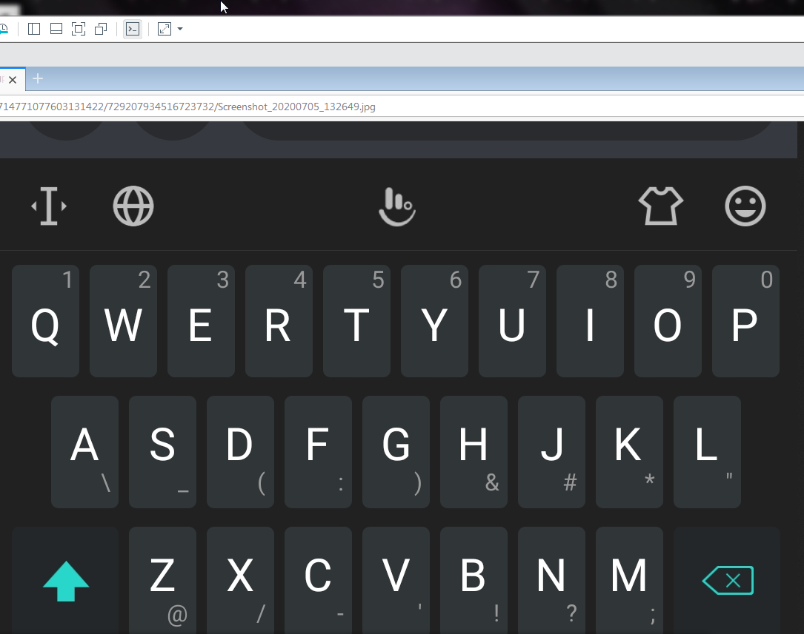

# The AKC (The android keyboard cipher) Project Assignment 

## Scenario
You are a junior ASIO Agent working for the Australian Security Intelligence Organization

On the July the 5th 2020 an senior agent has managed to intercept a new 
encryption scheme of a suspected criminal syndicate as shown in the image below.


However further messages & communications were encrypted based upon the 
cipher above thus we cannot decipher the messages.

## Your mission
Your mission, should you choose to accept it 
is to create a "decryption" program based upon 
the image above to decipher the messages

Your program should take an input of the encrypted message and 
automatically display the decrypted the message.

Additionally, (if possible, a bonus feature and a nice to have) 
your program should be able to take an plain text input and transform it 
in encrypted form and display it out to the terminal.

## Intercepted messages
```
&\_ 5&3 0\-*\)3 &\_ !33? 43-38'3(

63_

&\'3 5&3 0\-*\)3 ;9'3( 59 \ _3-743 "9-\589?

\::84;\58'3

```

Good luck out there, agent!

